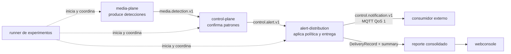

# Propósito y alcance

## Función dentro de E-OVRT

E-OVRT separa la percepción, la interpretación de riesgo y la entrega de avisos. El servicio de
distribución implementa la última frontera: convierte alertas confirmadas en notificaciones
entregables sin volver a decidir si existió una condición de riesgo.

Esta separación evita mezclar tres preguntas distintas:

1. ¿Qué se observó? Corresponde al media-plane.
2. ¿La evidencia satisface un patrón y genera una alerta? Corresponde al control-plane.
3. ¿Esta alerta debe notificarse ahora y cuál fue el resultado de entrega? Corresponde al
   distribuidor.

## Responsabilidades

El servicio:

- consume alertas `control.alert.v1` ya confirmadas;
- admite una fuente persistida (`alerts.jsonl`) o el bus ZeroMQ del control-plane;
- adapta cada alerta válida a `control.notification.v1`;
- genera un `notification_id` determinista a partir de `alert_id`;
- evita volver a entregar exactamente la misma notificación por el mismo canal;
- aplica cooldown a alertas semánticamente relacionadas;
- publica por MQTT con QoS 1 o simula la publicación en `dry_run`;
- reintenta fallos transitorios con una espera fija;
- registra intentos, supresiones, duplicados, entregas y agotamientos;
- calcula métricas de latencia compatibles con el modo de ejecución;
- produce artefactos que el reporte experimental y la webconsole pueden interpretar.

## Frontera negativa

El servicio deliberadamente no:

- recibe frames de video ni ejecuta inferencia;
- interpreta detecciones o evalúa patrones temporales;
- crea una alerta de dominio ni cambia su severidad;
- resuelve o reabre episodios del control-plane;
- altera el estado persistido por el productor;
- ofrece un dashboard propio;
- coordina múltiples corridas simultáneas: el daemon HTTP (`eovrt-distribute serve`, ADR-019)
  existe y es compartido entre experimentos, pero admite una corrida activa a la vez y no ofrece
  cola compartida ni administración global;
- coordina múltiples distribuidores sobre un ledger común;
- promete entrega exactly-once a un consumidor remoto.

Una entrada inválida tampoco se transforma en una alerta “corregida”. Se contabiliza en
`skipped_invalid_alerts` y el proceso continúa con las demás entradas.

## Unidad de trabajo

La unidad recibida es una alerta confirmada. La unidad idempotente de entrega es el par
`(notification_id, channel)`. Como en esta iteración el único canal es MQTT, dos ejecuciones que
usen el mismo directorio de salida reconocerán una alerta entregada previamente y registrarán
`skipped_duplicate`.

El cooldown opera en otro nivel. Su clave por defecto es `(condition_id, source_id)`: puede suprimir
una alerta nueva —con otro `alert_id`— si representa la misma condición en la misma fuente dentro de
la ventana configurada. Esta diferencia es esencial:

| Mecanismo | Compara | Evita |
|---|---|---|
| Idempotencia | misma notificación y canal | repetir una entrega exacta |
| Cooldown | misma clave semántica dentro de una ventana | fatiga por alertas próximas |

## Resultado observable

Cada alerta válida termina representada por uno o más `DeliveryRecord`:

- una decisión sin envío: `skipped_duplicate` o `suppressed_cooldown`;
- uno o más intentos `failed`, seguidos eventualmente por `delivered`;
- intentos `failed` y un `dead_letter` cuando se agota el máximo.

El resultado no queda solo en memoria. Se persiste en el ledger y se resume para que otras capas
puedan mostrar outcomes y medir la distribución sin acoplarse al canal MQTT.

## Siguiente lectura

- [Arquitectura interna](02-arquitectura.md)
- [Lógica exacta de decisión](03-logica-de-distribucion.md)
- [Contratos y outcomes](04-contratos-y-artefactos.md)
