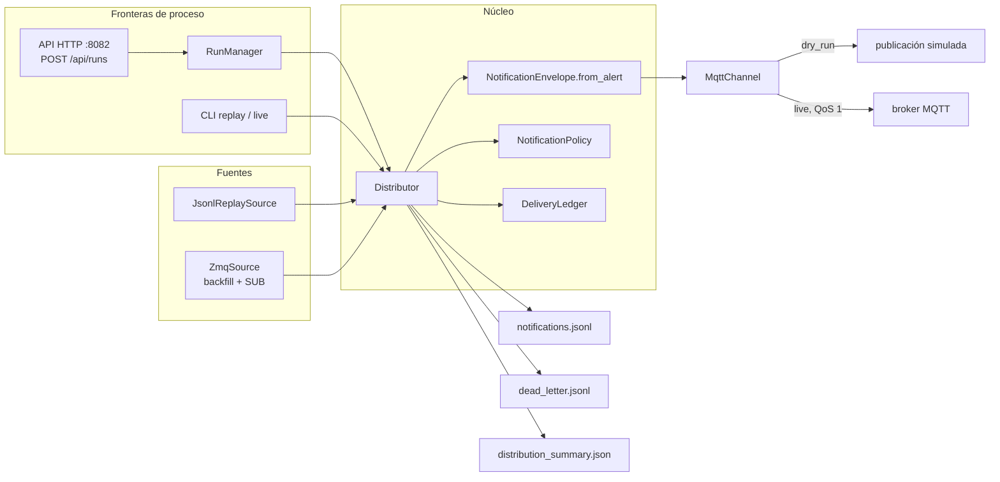

# Arquitectura

## Vista general

`e-ovrt_alert-distribution` es un paquete Python 3.11 con dos fronteras de proceso:

- el **servicio HTTP** `eovrt-distribute serve` (FastAPI/uvicorn, extra `service`), daemon de vida
  larga en `:8082` que expone el pipeline vía `POST /api/runs` (ADR-019 — ver §9.1/9.3 de
  `docs/specs/45-distribucion-alertas.md` en el repo documental). Es el camino por default del
  runner de la webconsole (ADR-020): el runner dispara la corrida y pollea `GET /api/runs/{id}`
  hasta su estado terminal;
- el **CLI** `eovrt-distribute replay|live`, que ejecuta una corrida por proceso. Sigue siendo el
  camino offline y de ejecución directa, y sobrevive como fallback operativo del runner
  (`EOVRT_CONSOLE_DISTRIBUTION_TRANSPORT=subprocess`).

**✎ Historia (2026-08-18):** hasta ADR-019 no existía servidor HTTP ni proceso global de
distribución — el runner iniciaba una instancia CLI por experimento (ADR-018, derogada por
ADR-020).

La arquitectura mantiene aisladas cuatro responsabilidades: adquisición, adaptación contractual,
decisión de entrega y transporte.



## Componentes

### CLI

`src/eovrt_distribution/cli.py` es la frontera pública. Interpreta `replay` o `live`, valida los
argumentos, carga `DistributionConfig`, construye la fuente y conecta las dependencias del
`Distributor`. Al terminar imprime por stdout el mismo objeto que persiste como
`distribution_summary.json`.

La CLI no implementa reglas de negocio: ambos subcomandos convergen en `_build()` y usan el mismo
nucleo. El tercer subcomando, `serve`, no ejecuta corridas por sí mismo: levanta el servicio HTTP
descrito a continuación (falla con un mensaje explícito si falta el extra `service`).

### Servicio HTTP

`src/eovrt_distribution/service/` implementa el daemon de `:8082` (ADR-019):

- `app.py` construye la aplicación FastAPI y monta los routers;
- `routers/health.py` expone `/healthz` y `/readyz`;
- `routers/config.py` expone la configuración efectiva;
- `routers/runs.py` expone `POST /api/runs` (dispara `replay` o `live`), `GET /api/runs/{id}`
  (estado y summary) y `POST /api/runs/{id}/cancel` (parada cooperativa);
- `run_request.py` valida el pedido; `run_ids.py` genera el `distribution_run_id`;
- `settings.py` resuelve el entorno del servicio (`EOVRT_DISTRIBUTION_RUNS_DIR`);
- `run_manager.py` ejecuta la corrida: compone **el mismo grafo que el CLI** (fuente, política,
  ledger, canal y `Distributor`), admite una corrida activa a la vez y transiciona por los estados
  `running` / `succeeded` / `failed` / `cancelled`.

### Fuentes

Las fuentes entregan objetos `SourcedAlert` con dos datos:

- `alert`: objeto JSON de la alerta;
- `ts_publish_ms`: instante wall-clock de publicación, disponible en el bus live y ausente en
  replay/backfill.

`JsonlReplaySource` recorre líneas JSON. Ignora líneas vacías, contabiliza JSON malformado en
`skipped_malformed` y deja que la capa contractual decida si un objeto JSON representa una alerta
válida.

`ZmqSource` conecta un socket SUB al endpoint publicado por el control-plane. Puede reproducir
primero un archivo de backfill, luego consume topics `control.alert.v1.<control_run_id>` y
`run.lifecycle.v1.<control_run_id>`. También:

- descarta eventos de otras corridas;
- evita repetir por bus los `alert_id` ya vistos en backfill;
- cuenta huecos de `seq` como `bus_dropped_events`;
- termina al recibir `run_finished`, alcanzar el idle timeout o recibir `request_stop()`;
- crea y cierra el socket en el mismo hilo que lo itera.

### Adaptación contractual

`NotificationEnvelope.from_alert()` valida la entrada con `_AlertInput` y construye una
notificación independiente del formato de transporte. La adaptación:

- conserva las identidades y atributos relevantes de la alerta;
- renombra `state` como `episode_state`;
- renombra `timestamp_ms` como `media_timestamp_ms`;
- usa `ts_publish_ms` como `confirmed_wall_ms` en live;
- deriva `notification_id` mediante SHA-1 truncado de `alert_id`;
- genera un texto breve y determinista en `summary_text`.

El modelo de entrada permite campos adicionales para mantener compatibilidad aditiva con
`control.alert.v1`, pero exige los campos consumidos por la distribución.

### Política

`NotificationPolicy` mantiene en memoria el último instante notificado por la clave configurada.
Por defecto la clave es `(condition_id, source_id)` y el tiempo usado es `media_timestamp_ms`, con
fallback a wall-clock si la alerta no posee tiempo de media.

La política separa consulta y mutación:

- `is_suppressed()` comprueba la ventana;
- `mark_notified()` actualiza el estado únicamente después de una entrega exitosa.

Así, un broker caído no silencia una alerta posterior por haber “consumido” el cooldown sin
notificar.

### Ledger

`DeliveryLedger` usa `notifications.jsonl` como respaldo. La clave idempotente es
`(notification_id, channel)` y solo un registro `delivered` marca la clave como vista. Fallos,
supresiones y dead letters no bloquean una entrega futura exacta.

Al abrir un archivo existente, el ledger lo archiva íntegro como `notifications.<n>.jsonl` y abre
una generación vigente nueva; nada se borra. Las claves ya entregadas se rehidratan leyendo **todas**
las generaciones del directorio, de modo que la idempotencia es acumulativa entre reejecuciones.

### Canal MQTT

`MqttChannel` es el único canal. En `dry_run` serializa el envelope y conserva la publicación en
memoria sin I/O. En `live` crea perezosamente un cliente Paho, conecta al broker, mantiene su loop
durante la ejecución y publica en `<topic_prefix>/<severity>` con QoS 1.

El envío se considera exitoso después del PUBACK. Un timeout de publicación o un fallo de red se
devuelve como `SendResult(ok=False)` para que el `Distributor` aplique retry, y el canal resetea su
cliente para que ese retry reconecte en vez de golpear un cliente muerto. La ausencia de la
dependencia opcional `paho-mqtt` en modo live produce un `ChannelError` explícito.

### Orquestador

`Distributor.run()` es el único lugar que ordena el pipeline. Crea los artefactos, mantiene conteos
y latencias, ejecuta las decisiones por alerta y garantiza `channel.close()` mediante `finally`.
Al final escribe el summary aun cuando todas las alertas hayan sido inválidas, duplicadas o
suprimidas, siempre que no ocurra un fallo fatal de I/O o una excepción no recuperable.

## Dependencias y dirección del acoplamiento

Las capas externas dependen del núcleo, no al revés:

- el CLI conoce configuración, fuentes, política y canal;
- el servicio HTTP no duplica reglas: `RunManager` compone el mismo grafo que el CLI (fuente,
  política, ledger, canal y `Distributor`) y delega toda la lógica de distribución en el núcleo;
- el distribuidor conoce las interfaces concretas recibidas, pero no conoce al runner ni a la
  webconsole;
- los contratos no dependen de MQTT ni de ZeroMQ;
- el reporte consume artefactos; el distribuidor no importa código del reporte.

Esto permite ejecutar la lógica con `DirectSource` y `dry_run` en pruebas, sin broker ni procesos
externos.

## Modelo de despliegue

Hay dos unidades de despliegue:

```text
# default de la plataforma (ADR-019/ADR-020): servicio HTTP de vida larga
eovrt-distribute serve                       :8082
  └── RunManager (una corrida activa a la vez)
        ├── conexión opcional al bus ZeroMQ
        ├── conexión opcional al broker MQTT
        └── escritura en el out_dir del request (runs/exp_<id>/distribution/)

# fallback operativo del runner / camino offline y ejecución directa
runner (EOVRT_CONSOLE_DISTRIBUTION_TRANSPORT=subprocess) o ejecución manual
  └── eovrt-distribute replay|live
        ├── conexión opcional al bus ZeroMQ
        ├── conexión opcional al broker MQTT
        └── escritura en runs/exp_<id>/distribution/
```

En el camino por subproceso el proceso termina con la corrida; bajo `serve`, la corrida termina
pero el daemon persiste. El broker es una dependencia separada que, en el laboratorio single-host,
se liga a loopback. Desde 2026-08-19 el repositorio mantiene una imagen Docker propia
(`infra/docker/Dockerfile`) para el compose de la plataforma.

**✎ Historia (2026-08-18):** hasta esa fecha la única unidad de despliegue era el subproceso por
experimento (ADR-018). ADR-019 introdujo el servicio y ADR-020 derogó a ADR-018, invirtiendo el
default del runner.

## Estructura del paquete

```text
src/eovrt_distribution/
├── cli.py                 frontera de proceso (replay, live, serve)
├── config.py              configuración estricta
├── distributor.py         orquestación del pipeline
├── ledger.py              idempotencia persistida
├── policy.py              cooldown
├── sources.py             fuentes direct y replay
├── channels/
│   ├── base.py            SendResult y ChannelError
│   └── mqtt.py            transporte MQTT
├── contracts/
│   ├── notification.py    control.notification.v1
│   └── delivery.py        control.delivery.v1
├── service/               servicio HTTP :8082 (ADR-019)
│   ├── app.py             construcción de la app FastAPI
│   ├── run_manager.py     ciclo de vida de la corrida (una activa a la vez)
│   ├── run_request.py     validación del pedido POST /api/runs
│   ├── run_ids.py         generación de distribution_run_id
│   ├── settings.py        entorno del servicio (EOVRT_DISTRIBUTION_RUNS_DIR)
│   └── routers/
│       ├── health.py      /healthz y /readyz
│       ├── config.py      configuración efectiva expuesta
│       └── runs.py        POST /api/runs, GET /api/runs/{id}, cancel
└── transport/
    ├── envelope.py        bus.envelope.v1
    └── zmq_source.py      fuente live y backfill
```

## Siguiente lectura

- [Lógica de distribución](03-logica-de-distribucion.md)
- [Contratos y artefactos](04-contratos-y-artefactos.md)
- [Integración con la plataforma](05-integracion-con-la-plataforma.md)
