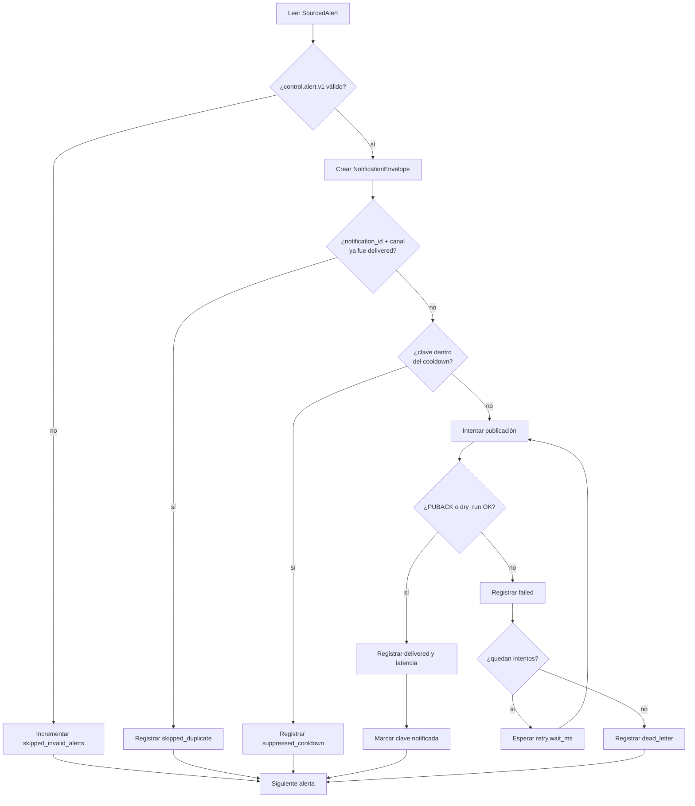

# Lógica de distribución

## Flujo por alerta

Cada elemento de la fuente atraviesa el mismo orden de decisiones. El orden es parte de la
semántica: cambiarlo podría publicar duplicados, suprimir alertas que nunca se entregaron o perder
evidencia de retry.



## 1. Lectura y validación

La fuente decide qué puede leerse como JSON o envelope de bus. El adaptador contractual decide qué
puede interpretarse como `control.alert.v1`. Son fallos distintos:

- una línea que no es JSON o un envelope wire inválido incrementa `source_stats.skipped_malformed`;
- un JSON válido que no cumple el contrato de alerta incrementa `skipped_invalid_alerts`.

Ninguno aborta la corrida. El objetivo es aislar una entrada defectuosa y conservar el resultado de
las demás. Un fallo de acceso al archivo, corrupción del ledger o error no recuperable sí queda
visible como fallo del proceso.

## 2. Identidad determinista

La notificación deriva su identidad de la alerta:

```text
notification_id = SHA1(alert_id UTF-8)[0:16]
```

El ID no depende de la hora, del intento ni de la ejecución del distribuidor. La misma alerta
produce siempre la misma notificación, condición necesaria para replays idempotentes.

## 3. Deduplicación exacta

Antes de aplicar cooldown o publicar, el distribuidor pregunta al ledger si existe una entrega
previa para `(notification_id, "mqtt")`. Solo `delivered` alimenta ese índice.

Si la clave existe, se agrega un nuevo `DeliveryRecord` con:

- `attempt: 0`;
- `outcome: "skipped_duplicate"`;
- sin latencia ni `delivered_at`.

No se consulta al broker: el ledger local es la evidencia de que el proceso recibió PUBACK o que el
modo `dry_run` completó el envío simulado.

## 4. Supresión por cooldown

Si la notificación no es duplicada, se forma una clave con los campos configurados. Los únicos
campos admitidos son `condition_id`, `source_id` y `subject_key`; al menos uno debe estar presente.

La configuración por defecto:

```yaml
notification_policy:
  cooldown_ms: 30000
  key: [condition_id, source_id]
```

Para comparar se usa `media_timestamp_ms`. Esto hace consistente la política entre replay y live:
dos alertas del mismo video conservan su distancia temporal aunque el replay ocurra mucho después.
Si el timestamp de media es nulo, se usa wall-clock.

La **base de tiempo se declara junto al timestamp**: la política guarda el par
`(base, timestamp)`, con base `media` o `wall` según el caso anterior. Ante bases
incomparables —la alerta actual llega con una base distinta de la registrada para su clave— la
notificación **nunca se suprime**: restar wall-clock contra tiempo de media produciría una
diferencia sin significado, y el sesgo elegido es dejar pasar la notificación antes que suprimirla
por una resta inválida.

Cuando `current_time - last_notified_time < cooldown_ms` **sobre la misma base**, se registra
`suppressed_cooldown`. Un valor `cooldown_ms: 0` desactiva la supresión.

La clave se marca solo luego de `delivered`. Los resultados `failed` y `dead_letter` no consumen la
ventana, de modo que una alerta posterior todavía puede intentar llegar al consumidor.

El estado de cooldown vive en memoria y comienza vacío en cada proceso. A diferencia de la
idempotencia, no se reconstruye desde el ledger.

## 5. Publicación y retry

El canal serializa el `NotificationEnvelope` completo como JSON y lo publica en:

```text
<topic_prefix>/<severity>
```

Con el valor por defecto, una alerta `high` se publica en `eovrt/alerts/high`.

Por cada fallo se persiste inmediatamente un registro `failed` con el número de intento y la causa.
Si quedan intentos, el distribuidor espera `retry.wait_ms` y vuelve a enviar. No existe backoff ni
jitter: la espera es fija.

Ante un fallo de publicación —timeout sin PUBACK o error de red— el canal **resetea su cliente MQTT**
(`loop_stop` + `disconnect`, con los errores del cierre absorbidos) antes de devolver
`SendResult(ok=False)`. Así el siguiente intento crea un cliente nuevo y **reconecta**, en vez de
reintentar contra un cliente ya muerto. El reset no agrega backoff ni sesión persistente: ADR-005
(serie del proyecto, tres dígitos) recorta esta iteración a retry mínimo.

Al obtener éxito:

1. se calcula la latencia;
2. se registra `delivered`;
3. el ledger incorpora la clave a su índice;
4. la política marca la clave semántica como notificada;
5. no se ejecutan más intentos.

Al agotar `retry.max_attempts`, además del último `failed` se registra un `dead_letter` con el mismo
número de intento. Este registro se escribe tanto en el ledger como en `dead_letter.jsonl`.

## 6. Latencia

El origen temporal depende de la disponibilidad de un instante comparable:

| `latency_mode` | Inicio | Fin | Interpretación |
|---|---|---|---|
| `live` | `ts_publish_ms` del envelope de bus | PUBACK MQTT | demora alerta-publicada → notificación confirmada |
| `wall_clock_dbe` | inicio local del ciclo de retry | PUBACK o éxito dry-run | costo de distribución durante el replay |

En DBE no se resta el timestamp histórico de la alerta al wall-clock actual; hacerlo produciría una
métrica sin significado. Los retries sí forman parte del tiempo `wall_clock_dbe` porque el inicio se
toma antes del primer intento.

Solo los records `delivered` alimentan los agregados. El summary agrupa por modo y calcula `count`,
`min`, media aritmética y p95 nearest-rank. Si no hubo entregas, `talert_notification_ms` es `null`.

## 7. Reejecución y generaciones

Al comenzar una ejecución sobre un `notifications.jsonl` existente, el ledger:

1. archiva el archivo vigente íntegro como `notifications.<n>.jsonl`, con `n` el primer índice
   libre a partir de 1;
2. lee **todas** las generaciones archivadas del directorio y reconstruye el conjunto de claves
   `(notification_id, channel)` con outcome `delivered`;
3. abre una generación vigente nueva y agrega allí los outcomes de esta ejecución.

**Ninguna fila se borra jamás**: no hay compactación. Los `failed`, `suppressed_cooldown` y
`dead_letter` de ejecuciones anteriores siguen en disco, en su generación. El ledger es append-only
también entre procesos: lo único que cambia entre ejecuciones es qué archivo es el vigente.

La rehidratación es **acumulativa sobre todas las generaciones**, no solo sobre la última: una
entrega registrada en cualquier corrida previa sigue considerándose entregada, y una alerta ya
entregada se clasifica como `skipped_duplicate` sin volver a publicarse.

`dead_letter.jsonl` representa solo la ejecución actual y sigue la misma regla: al inicio la
generación previa se archiva como `dead_letter.<n>.jsonl` en vez de eliminarse. Una corrida
posterior exitosa no hereda agotamientos antiguos en el archivo vigente, pero la evidencia de los
antiguos queda disponible al lado.

Los consumidores del artefacto (reporte y agregación de la plataforma) leen `notifications.jsonl`
por nombre exacto, de modo que siempre ven la generación en curso.

## 8. Backfill y bus live

En live, `ZmqSource` puede leer primero `--backfill <alerts.jsonl>`. Conserva los `alert_id` vistos y
descarta la copia recibida después por el bus, contabilizándola en
`duplicates_from_backfill`. Esta deduplicación ocurre antes del ledger y evita procesar dos veces el
mismo hecho por dos fuentes de recuperación.

La fuente mantiene el último `seq` del bus para detectar saltos. Los huecos se suman en
`bus_dropped_events`; no pueden reconstruirse únicamente desde el socket, por lo que quedan
expuestos en el summary para interpretar la calidad de la corrida.

Si se proporciona `control_run_id`, la suscripción se limita a esa corrida. Sin él, la primera alerta
válida fija la corrida objetivo. Eventos de otras corridas se ignoran.

## 9. Terminación y cierre

La fuente live termina por una de estas razones, reflejada en `source_stats.termination_reason`:

- `run_finished`: sentinel del control-plane;
- `idle_timeout`: no llegaron mensajes durante el tiempo configurado;
- `requested_stop`: cancelación cooperativa.

El canal se cierra en un bloque `finally`, incluso si una excepción interrumpe el procesamiento. En
el camino normal, después de agotar la fuente se construye y persiste el summary. Cómo se observa
ese summary depende de la superficie de ejecución:

- por CLI (`replay`/`live`), el mismo objeto se imprime en una línea por stdout;
- bajo `serve` no hay stdout que observar: el summary se lee vía `GET /api/runs/{id}` cuando la
  corrida alcanza un estado terminal (`succeeded`, `failed` o `cancelled`).

## Siguiente lectura

- [Schemas, outcomes y archivos](04-contratos-y-artefactos.md)
- [Secuencias con el resto de la plataforma](05-integracion-con-la-plataforma.md)
- [Garantías y limitaciones](06-decisiones-y-limitaciones.md)
