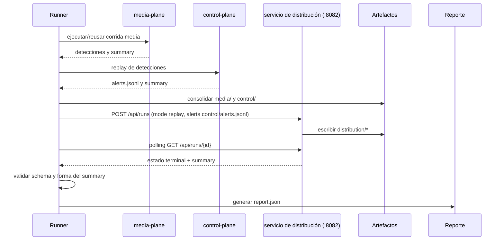
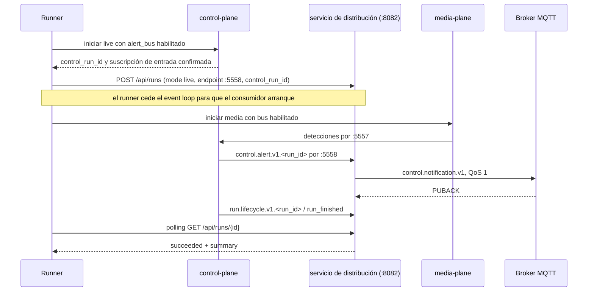

# Integración con la plataforma

## Dependencias entre planos

El distribuidor se integra mediante contratos y artefactos, no mediante imports cruzados:

| Componente | Relación con distribución |
|---|---|
| control-plane | produce `control.alert.v1`, `alerts.jsonl` y el bus de alertas |
| runner experimental | dispara la corrida por HTTP (`POST :8082/api/runs`), ordena la secuencia y valida el summary; subproceso CLI sólo como fallback |
| broker MQTT | recibe `control.notification.v1` con QoS 1 |
| consolidación | preserva `distribution/` como sibling de `media/` y `control/` |
| generador de reporte | incorpora summary y último outcome por alerta |
| webconsole | muestra conteos, p95, estado y outcome de notificación |

El distribuidor no necesita conocer las APIs HTTP de media-plane o control-plane. El runner absorbe
esa coordinación: por default (ADR-020) le habla al servicio de distribución (`eovrt-distribute
serve`, puerto `:8082`, espejo del control-plane — ver `docs/specs/45-distribucion-alertas.md` §9
en el repo documental). El preflight sondea `GET /healthz`, el disparo es `POST /api/runs` y el
runner pollea `GET /api/runs/{id}` hasta estado terminal (`succeeded` es el único éxito;
`failed`/`cancelled` se propagan como error). El subproceso CLI quedó como **fallback operativo**
(`EOVRT_CONSOLE_DISTRIBUTION_TRANSPORT=subprocess`) y **dejó de ser un patrón de acople**. Los
contratos de esta página (envelopes, buses, summary) son **idénticos por ambos caminos** —
verificado con la misma corrida por CLI y por HTTP produciendo `distribution_summary.json`
byte-equivalente salvo latencias.

> **✎ Historia (2026-08-18):** hasta ADR-019/ADR-020 el único camino era el subproceso por
> experimento (ADR-018, derogada por ADR-020).

## Dos buses diferentes

La topología live usa dos flujos ZeroMQ con responsabilidades distintas:

```text
media-plane --detecciones--> control-plane --alertas--> alert-distribution
             :5557                         :5558
```

- `control.input.bus`, normalmente `tcp://127.0.0.1:5557`, transporta detecciones hacia el
  control-plane.
- `control.alert_bus`, normalmente publicado en `:5558`, transporta alertas confirmadas hacia el
  distribuidor.

Configurar `eovrt-distribute live --endpoint` con el bus de detecciones es un error de topología: el
consumidor espera topics `control.alert.v1.*` y envelopes de alerta.

## Integración DBE / replay

En replay, la distribución ocurre después de que media y control terminaron y sus artefactos fueron
consolidados.



En el fallback por subproceso (camino offline, `EOVRT_CONSOLE_DISTRIBUTION_TRANSPORT=subprocess`),
`POST /api/runs` y el polling se reemplazan por la ejecución de `eovrt-distribute replay` y la
lectura del summary por stdout, con la validación adicional stdout == archivo.

El runner exige que `runs.distribution.mode` coincida con `runs.control.mode`. Si la consolidación o
la distribución solicitada falla, marca el experimento como no exitoso y
`distribution_status: failed`; no presenta un reporte como si el módulo hubiera completado.

Ejemplo conceptual de manifiesto:

```yaml
runs:
  media:
    service: http://127.0.0.1:8080
    config: experiments/demo/media.yaml
    mode: run
  control:
    service: http://127.0.0.1:8081
    config: experiments/demo/control.yaml
    mode: replay
  distribution:
    service: eovrt-alert-distribution
    config: ../e-ovrt_alert-distribution/configs/example.yaml
    mode: replay
```

El campo `service` identifica el plano en el manifiesto. Por default el runner no resuelve ningún
ejecutable: le habla al servicio en `EOVRT_CONSOLE_DISTRIBUTION_SERVICE_URL` (default
`http://localhost:8082`). El ejecutable `eovrt-distribute` — instalado o el del `.venv` del
repositorio hermano — sólo se resuelve en el **fallback**
(`EOVRT_CONSOLE_DISTRIBUTION_TRANSPORT=subprocess`). El manifiesto no cambia entre caminos: la
selección del transporte es por entorno, no por manifiesto.

## Integración EBE / live

En live debe existir un suscriptor antes de que media pueda causar alertas, porque PUB/SUB no
retiene eventos enviados antes de la suscripción.



Cuando existe distribución, el runner habilita `alert_bus` en la configuración efectiva del
control-plane y eleva `wait_for_subscriber_ms` al menos a 10 segundos. Luego dispara la corrida de
distribución y le da una oportunidad explícita de comenzar antes de iniciar media. En el fallback
por subproceso la secuencia es la misma, con `eovrt-distribute live --endpoint :5558
--control-run-id ...` en lugar del `POST`.

El runner vigente pasa `control_run_id` y endpoint en el request (o al CLI en el fallback), pero no
pasa backfill en su secuencia live. La capacidad de backfill existe para una ejecución directa o
una integración que proporcione el archivo; no debe interpretarse como recuperación automática del
runner actual.

Si media o control fallan, el runner cancela la corrida de distribución: en el camino default llama
`POST /api/runs/{id}/cancel` (best-effort) para que el servicio detenga la corrida activa; en el
fallback termina el subproceso. Si el distribuidor falla o su summary no valida,
`distribution_status` queda en `failed` y el resultado global no es exitoso.

## Topics MQTT

El canal publica un JSON `control.notification.v1` en:

```text
<channel.topic_prefix>/<severity>
```

Con la configuración de ejemplo:

```text
eovrt/alerts/low
eovrt/alerts/medium
eovrt/alerts/high
```

La implementación no restringe el vocabulario de `severity`; utiliza el valor validado como string
por el contrato de alerta. El `topic_prefix` rechaza comodines MQTT `+` y `#` y bytes nulos para no
convertir una publicación concreta en una suscripción ambigua.

Las credenciales se leen exclusivamente de:

- `EOVRT_MQTT_USERNAME`;
- `EOVRT_MQTT_PASSWORD`.

Host, puerto, prefijo y QoS se toman de YAML. El modo live requiere el extra `mqtt`. El laboratorio
single-host usa un broker ligado a `127.0.0.1`; MQTT anónimo no debe exponerse fuera de loopback.

## Reporte consolidado

El generador de reportes lee los artefactos de forma tolerante:

- `distribution_summary.json` se incorpora como `report["distribucion"]` si es un objeto JSON
  válido;
- `notifications.jsonl` se recorre y el último record por `alert_id` forma
  `report["distribucion_por_alerta"]`;
- líneas corruptas o valores JSON que no sean objetos no rompen el reporte;
- la ausencia de artefactos se representa como distribución no ejecutada.

La métrica `t_alert-notification` usa el p95 `live` como valor operativo `computed`. Si solo existe
`wall_clock_dbe`, se marca `not_interpretable`: el costo de reproceso es útil para diagnóstico, pero
no sustituye la latencia real de una alerta en vivo.

## Webconsole

La webconsole nunca consulta al broker MQTT. Durante la corrida, su BFF (el runner) sí le habla al
servicio de distribución por HTTP — preflight `GET /healthz`, disparo `POST /api/runs` y polling de
`GET /api/runs/{id}` hasta estado terminal (ADR-020). Para mostrar una corrida, en cambio, lee el
`report.json` consolidado:

- conteos por outcome;
- p95 y estado de `t_alert-notification`;
- alertas inválidas omitidas;
- último outcome de entrega en la columna “Notificada”.

Esta lectura desacoplada permite abrir una corrida terminada aunque el servicio de distribución y
el broker ya no estén activos. El costo del acople HTTP es el inverso: cuando la distribución está
habilitada, la webconsole exige el servicio arriba para poder correr.

## Ejecución directa

El runner es el camino de plataforma, pero el mismo contrato puede verificarse directamente:

```bash
eovrt-distribute replay \
  --alerts /ruta/control/alerts.jsonl \
  --out-dir /ruta/experimento/distribution \
  --config configs/example.yaml
```

```bash
eovrt-distribute live \
  --endpoint tcp://127.0.0.1:5558 \
  --control-run-id ctrl-001 \
  --out-dir /ruta/experimento/distribution \
  --config configs/example.yaml \
  --idle-timeout-ms 300000
```

`--idle-timeout-ms` debe ser finito y mayor que cero. En live también puede proporcionarse
`--backfill /ruta/control/alerts.jsonl`.

## Siguiente lectura

- [Contratos que atraviesan estas integraciones](04-contratos-y-artefactos.md)
- [Garantías y capacidades excluidas](06-decisiones-y-limitaciones.md)
